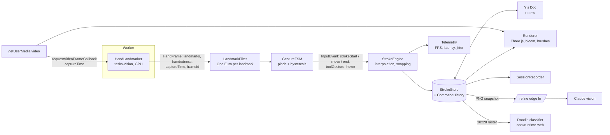

# Afterglow: Project Brief for Claude Code

> Paste this whole file into the repo root as `PROJECT_BRIEF.md`, then tell Claude Code:
> "Read PROJECT_BRIEF.md fully. Start with Phase 0. Work one phase at a time and stop for my review at every phase gate."

---

## 0. How you (Claude Code) should work on this project

You are the lead engineer on a portfolio project that will be reviewed by senior engineers at top companies. Code quality, architecture, testing, and measured performance matter as much as features. Follow these rules for the entire project:

1. **Read this entire brief before writing any code.** Then create `CLAUDE.md` in the repo root summarizing the conventions, commands, and architecture rules below so future sessions stay consistent.
2. **Work phase by phase.** At the start of each phase, enter plan mode, write a short plan (files to create, interfaces, tests, risks), and wait for my approval. At the end of each phase, run the full test suite, lint, typecheck, and build, then summarize what was done, what was measured, and what is left. Do not start the next phase until I say so.
3. **Verify, don't assume, library versions and APIs.** Before installing a package, check the latest stable version and read its current docs. In particular:
   - **Never use the legacy MediaPipe Solutions API** (`@mediapipe/hands`, `mp.solutions.hands`). It is deprecated and removed from recent Python releases. Use **MediaPipe Tasks** (`@mediapipe/tasks-vision` `HandLandmarker` on the web, `mediapipe.tasks.python.vision.HandLandmarker` in Python).
   - Pin exact versions in lockfiles.
4. **Keep the core pure.** Anything in `packages/core` must be framework-free, DOM-free, deterministic TypeScript that can run in Node, a browser, or a Web Worker. This is what makes the project testable.
5. **Small, conventional commits** (`feat(core): add one euro filter`, `test(core): ...`, `perf(render): ...`). One logical change per commit.
6. **Every non-trivial decision gets a short ADR** in `docs/adr/NNNN-title.md` (context, decision, alternatives, consequences).
7. **No placeholder code, no TODO stubs left behind, no mock data presented as real.** If something cannot be done, say so and propose an alternative.
8. **Ask me before** adding a new top-level dependency not listed in this brief, changing the architecture described here, or spending money (paid APIs, hosting).

---

## 1. The product

**Afterglow** is a real-time, in-browser **light-painting studio** controlled by your hands. You point at your webcam and paint with glowing trails of light, like long-exposure light-painting photography, but live, editable, and shareable.

### Why this is different from the hundreds of "air canvas" repos

Most air canvas projects are a single Python script that draws flat OpenCV lines when one finger is raised. Afterglow differs on four axes:

| Axis | Typical air canvas | Afterglow |
|---|---|---|
| Visual | Flat 2px lines on a webcam feed | GPU-rendered light trails with bloom, depth-driven brush width, particle and ribbon brushes, "long exposure" darkroom mode |
| Input quality | Raw, jittery landmarks; finger-up heuristic that breaks on rotation | One Euro filtered signal, pinch gesture with hysteresis, explicit gesture state machine, measured jitter and latency |
| Intelligence | None, or EMNIST letters | Shape snapping, on-device doodle recognition (own trained model with eval report), and "Refine" which sends a sketch to a Claude vision model and animates back clean vector art |
| Engineering | No tests, no metrics, no deploy | Monorepo, pure core with replay-based deterministic tests, live telemetry HUD, benchmark page, CI with performance budgets, deployed live, multiplayer rooms |

### Signature features (the "wow" moments)

1. **Live light painting.** Strokes glow, bloom, and slowly fade like real long exposure unless "fix" is enabled. Moving your hand closer to the camera makes the stroke brighter and thicker (using MediaPipe's relative z).
2. **Darkroom mode.** The webcam feed is dimmed and desaturated so you look like a silhouette with light pouring from your fingertip. This is the default look and the hero of the demo video.
3. **Timelapse replay.** Every session is stored as a stroke timeline. Replay it as an animation and export it as a WebM video or PNG "long exposure" still.
4. **Refine with Claude.** Draw a rough sketch, make the "refine" gesture, and a clean, stylized vector version draws itself stroke by stroke in light.
5. **Rooms.** Share a link; friends join and paint in the same canvas in real time, each with their own glowing hand cursor.
6. **Filter Lab.** A public page where you can see raw vs EMA vs Kalman vs One Euro signals side by side on recorded sessions, with live jitter and lag numbers. This is the page engineers will remember.

### Non-goals

- Native mobile apps, VR/AR headsets, user accounts with passwords, payments.

---

## 2. Tech stack

Verify current stable versions before installing. Use these choices unless there is a strong reason not to; if so, raise it with me first.

### Frontend (`apps/web`)
- **TypeScript** in `strict` mode everywhere, with `noUncheckedIndexedAccess`.
- **Vite** + **React 19**.
- **Zustand** for UI state (tool, color, room, settings). The real-time drawing pipeline must NOT go through React state; it runs in its own loop.
- **Three.js** (WebGL2) for rendering strokes, bloom (`EffectComposer` + `UnrealBloomPass`), and particles. Keep all Three.js code inside `packages/render`.
- **perfect-freehand** for stroke outline geometry from points with simulated pressure.
- **@mediapipe/tasks-vision** `HandLandmarker` (GPU delegate, `VIDEO` running mode).
- **onnxruntime-web** for in-browser doodle recognition.
- **Yjs** + **y-websocket** client + Yjs Awareness for multiplayer.
- **CSS Modules** or vanilla-extract for styling (no Tailwind; the design is bespoke).
- **Vitest** for unit tests, **Playwright** for end-to-end tests.

### Realtime server (`apps/realtime`)
- **Node.js** + `y-websocket` server utilities (or `@hocuspocus/server` if it is a better fit after you check current docs).
- Room persistence: snapshot Yjs documents to **SQLite** (via `better-sqlite3`) in development and a managed Postgres or object storage in production. Start with SQLite.
- Deploy target: **Fly.io** or **Railway** (Docker image).

### API (`apps/api`)
- A small edge/serverless function (**Cloudflare Workers** with **Hono**, or Vercel Functions) that proxies the "Refine" request to the **Anthropic Messages API** using a current Claude vision-capable model set via the `ANTHROPIC_MODEL` env var.
- API key only on the server. Rate limiting per IP (e.g. token bucket in Workers KV/Durable Objects or Upstash). Request size limits. Input validation with **Zod**.

### ML (`ml/`)
- **Python 3.12**, **uv** for environment management.
- **PyTorch** for training, **ONNX** export, `onnxruntime` for validation, `pytest` for tests.
- Dataset: **Google Quick, Draw!** (simplified stroke format), a curated subset of 30 to 50 classes.

### Tooling
- **pnpm workspaces** + **Turborepo**.
- **ESLint** (typescript-eslint strict), **Prettier**, **Ruff** + **mypy** for Python.
- **GitHub Actions**: lint, typecheck, unit tests, e2e tests, build, bundle-size budget check, Lighthouse CI on the deployed preview.
- Frontend deploy: **Vercel** or **Cloudflare Pages**, with preview deployments per PR.

---

## 3. Architecture

### 3.1 Repository layout

```
afterglow/
├── apps/
│   ├── web/                 # Vite + React app (studio, landing, filter lab, bench)
│   ├── realtime/            # Yjs websocket server for rooms
│   └── api/                 # Edge function: /refine proxy to Claude
├── packages/
│   ├── core/                # PURE TS: types, filters, gesture FSM, stroke engine,
│   │                        # geometry, $1 recognizer, command history, session format
│   ├── tracking/            # Camera + MediaPipe HandLandmarker adapter + worker
│   ├── render/              # Three.js renderer, brushes, bloom, darkroom compositing
│   ├── collab/              # Yjs document schema + binding to core stroke store
│   └── ui/                  # Shared React components and design tokens
├── ml/                      # Python: data prep, training, eval, ONNX export
├── fixtures/sessions/       # Recorded landmark sessions (JSON) for tests and Filter Lab
├── docs/
│   ├── adr/
│   ├── architecture.md      # With a Mermaid diagram
│   └── benchmarks.md        # Measured results, method, hardware
├── .github/workflows/
├── CLAUDE.md
└── PROJECT_BRIEF.md
```

### 3.2 Runtime data flow



Rules:
- The **Worker** owns MediaPipe inference. Frames are transferred as `ImageBitmap` (transferable). If GPU delegate in a worker turns out to be unreliable in current browsers, document it in an ADR and fall back to main-thread inference behind the same interface.
- The **frame loop** is driven by `HTMLVideoElement.requestVideoFrameCallback`, not `requestAnimationFrame`. Render runs on `requestAnimationFrame` and draws the latest state.
- Every `HandFrame` carries `captureTime` (from rVFC metadata) and a monotonic `frameId`. **All latency is measured from capture time**, never from when a result was emitted.
- Everything from `LandmarkFilter` to `StrokeStore` lives in `packages/core` and is pure: `(state, input) => [newState, outputs]`. No `Date.now()` inside core; time is always passed in.

### 3.3 Core types (starting point; refine in Phase 1 plan)

```ts
// packages/core/src/types.ts
export type Vec3 = { x: number; y: number; z: number };      // normalized [0,1] x,y; relative z
export type Handedness = 'Left' | 'Right';

export interface HandFrame {
  frameId: number;
  captureTime: number;            // ms, from rVFC
  hands: Array<{
    handedness: Handedness;       // after mirroring correction
    score: number;
    landmarks: Vec3[];            // length 21
  }>;
}

export type PenState = 'idle' | 'hover' | 'drawing' | 'menu' | 'paused';

export type InputEvent =
  | { type: 'strokeStart'; t: number; p: Vec3; handId: Handedness }
  | { type: 'strokeMove'; t: number; p: Vec3; handId: Handedness }
  | { type: 'strokeEnd'; t: number; handId: Handedness; reason: 'release' | 'handLost' }
  | { type: 'hover'; t: number; p: Vec3; handId: Handedness }
  | { type: 'gesture'; t: number; name: ToolGesture; handId: Handedness };

export type ToolGesture = 'openMenu' | 'undo' | 'redo' | 'clear' | 'refine' | 'pause';

export interface Stroke {
  id: string;                     // nanoid
  authorId: string;
  brush: BrushId;
  color: string;                  // hex
  points: Array<{ x: number; y: number; z: number; t: number }>; // canvas space
  createdAt: number;
  snappedShape?: SnappedShape;
}

export interface SessionRecording {
  version: 1;
  meta: { userAgent: string; videoWidth: number; videoHeight: number; fps: number; notes?: string };
  frames: HandFrame[];
}
```

### 3.4 Coordinate spaces

Define and document three spaces and never mix them:
1. **Landmark space**: MediaPipe normalized coords of the *unmirrored* camera image.
2. **View space**: mirrored for display (`x' = 1 - x`), used for everything the user sees and does.
3. **Canvas space**: world units of the drawing, independent of window size, so strokes survive resize and sync across clients with different screens.

One module, `packages/core/src/coords.ts`, owns all conversions, with tests.

### 3.5 Signal processing (`packages/core/src/filters`)

- Implement a common interface `Filter<T> { next(value: T, t: number): T; reset(): void }`.
- Implementations: `PassThrough`, `EmaFilter`, `KalmanFilter` (constant velocity), `OneEuroFilter` (Casiez et al., CHI 2012; parameters `minCutoff`, `beta`, `dCutoff`).
- `LandmarkFilter` applies a filter per landmark per axis, keyed by handedness (not array index), and **resets on hand loss**.
- Defaults tuned on recorded fixtures; tuning results written to `docs/benchmarks.md`.

### 3.6 Gesture state machine (`packages/core/src/gesture`)

- **Pinch-to-draw**: `d = dist(thumbTip[4], indexTip[8]) / dist(wrist[0], middleMCP[9])` (scale invariant).
- **Hysteresis**: enter `drawing` when `d < enterThreshold` (start ~0.25), exit when `d > exitThreshold` (start ~0.35). Require N consecutive frames (start 2) to change state. All thresholds configurable and calibrated per user in onboarding.
- **Hand loss**: grace period of a few frames before emitting `strokeEnd { reason: 'handLost' }`.
- **Tool gestures** (debounced, with cooldown): open palm held 400ms opens the radial menu; fist pauses; two-finger swipe left/right is undo/redo; a "frame" gesture with both hands triggers Refine (verify it is reliably detectable; if not, pick another and write an ADR).
- Model as an explicit transition table. Render the FSM as a Mermaid diagram in docs, generated from the same table if practical.

### 3.7 Stroke engine (`packages/core/src/stroke`)

- Converts `InputEvent`s into `Stroke`s: interpolates gaps (Catmull-Rom) when the fingertip moves far between frames, drops near-duplicate points, stamps time.
- **Shape snapping**: on `strokeEnd`, run the $1 Unistroke Recognizer plus least-squares line and circle fits; if confidence > threshold, replace with a clean primitive (line, circle, ellipse, rectangle, triangle, arrow) while keeping the original in `Stroke.raw` so undo can restore it. Snapping is toggleable.
- **CommandHistory**: command pattern (`AddStroke`, `RemoveStroke`, `Clear`, `SnapStroke`, `ReplaceWithRefined`) with undo/redo. In rooms, undo only affects your own strokes (use Yjs `UndoManager` scoped to the local origin).

### 3.8 Rendering (`packages/render`)

- Layer order: webcam video (darkroom treated) → stroke layer (additive blending) → bloom pass → UI cursor layer.
- **Brushes** (each a small module implementing a `Brush` interface):
  - `neon`: perfect-freehand outline, filled, additive, strong bloom.
  - `ribbon`: flat ribbon that twists with hand roll (from landmark geometry).
  - `sparks`: GPU particles emitted along the stroke with lifetime and drift.
  - `ink`: non-glowing matte stroke for contrast.
- **Depth to intensity**: map smoothed relative z to width and brightness, clamped, with a calibration step.
- **Long-exposure fade**: optional exponential decay of stroke brightness over time; "fix" mode keeps strokes permanent.
- **Darkroom mode**: shader that desaturates and darkens the video and adds subtle film grain.
- Performance budget: 60 FPS render on a 2020+ laptop with integrated graphics and 500 strokes on screen. Use instanced/merged geometry and dispose GPU resources correctly. Add a `?stress=1` URL flag that generates synthetic strokes for testing.
- Respect `prefers-reduced-motion` (no particle drift, no fade animation).

### 3.9 Intelligence

**Doodle recognition (on device)**
- `ml/` pipeline: download a subset of Quick, Draw! simplified NDJSON, rasterize strokes to 28x28 (same rasterizer logic as the browser, ported and tested for parity), train a small CNN (target under 1 MB after quantization), export to ONNX, validate with `onnxruntime`.
- Report in `ml/REPORT.md`: top-1 and top-3 accuracy on the held-out Quick, Draw! test split, confusion matrix, model size, browser inference latency, **and accuracy on a small set of air-drawn doodles** recorded from Afterglow itself (domain shift analysis). This comparison is a key portfolio talking point.
- In the app: after a stroke group settles, show a subtle label guess ("looks like a cat?") that the user can accept to tag the drawing.

**Refine with Claude**
- Client renders the current strokes to a PNG (strokes only, no video), sends it to `apps/api` `/refine`.
- The API calls the Anthropic Messages API with the image and a system prompt instructing the model to return **only** JSON: `{ "title": string, "paths": Array<{ "d": string, "color"?: string }> }` where `d` is SVG path data in a fixed 1000x1000 viewBox, limited to at most 40 paths. Validate with Zod; reject and retry once on invalid output.
- Client converts SVG paths to point sequences and animates them drawing in, stroke by stroke, with the neon brush, as a single undoable `ReplaceWithRefined` command.
- Handle errors visibly and calmly (timeout, rate limit, invalid output). Never block drawing while waiting.

### 3.10 Collaboration (`packages/collab`, `apps/realtime`)

- Yjs document schema: `Y.Map<StrokeId, Y.Map>` for strokes (points stored as a compact `Float32Array` encoded to `Uint8Array` once a stroke ends; live points streamed via Awareness while drawing to avoid thrashing the doc).
- Awareness state: `{ userId, name, color, cursor: {x,y,z}, penState }`. Remote cursors render as soft glowing hand markers.
- Rooms by URL (`/r/:roomId`), room ids are unguessable nanoids. Max participants per room (e.g. 8) enforced server side. Rooms expire after inactivity.
- Offline edits merge when reconnecting (CRDT property; add a test that simulates two clients editing concurrently and converging).

### 3.11 Telemetry and benchmarking

- **Live HUD** (toggle with `H`): inference FPS, render FPS, dropped frames (from rVFC `presentedFrames`), capture to landmark latency p50/p95, capture to ink-on-screen latency p50/p95, current pen state, pinch ratio with thresholds drawn.
- **Bench page** (`/bench`): replays every fixture in `fixtures/sessions/` through the core pipeline headlessly and reports per-frame core processing time, filter jitter (stationary RMS px) and lag (ms at controlled speed), and gesture metrics (broken strokes per minute, pen-state precision/recall against labeled fixtures).
- **Filter Lab** (`/lab`): interactive visualization of raw vs EMA vs Kalman vs One Euro on a chosen fixture, with sliders for parameters and live metric readouts. Also works live from the webcam.
- A Node script `pnpm bench` runs the same benchmarks in CI and fails if core processing time or jitter regress past thresholds.

### 3.12 Privacy and security

- Video never leaves the device. Only strokes (and, for Refine, a strokes-only PNG) are sent anywhere. State this clearly in the UI and README.
- No API keys in the client. CSP headers, CORS locked to the app origin, input size limits on every endpoint.
- Camera permission flow with a clear explanation screen before the browser prompt, and a helpful state when permission is denied.

---

## 4. Design direction

The live light trails are the single bold element. Everything else is quiet, precise, and recedes.

**Concept:** a night-time light-painting session. The interface should feel like the dark of a photographer's field at night, with color coming only from light sources: sodium streetlamps, tungsten, LED gels.

**Palette** (tokens in `packages/ui/tokens.ts`):
- `night` #141A33 (base background, deep indigo, not black)
- `fog` #8A93B8 (secondary text, borders)
- `paper` #E9ECF5 (primary text)
- Light colors for brushes: `sodium` #FFB547, `tungsten` #FFE3B0, `led-cyan` #5CE1E6, `gel-magenta` #FF4FA3, `gel-violet` #9D7BFF

**Type:** a characterful grotesque for display (e.g. Bricolage Grotesque) and a clean humanist sans for UI text (e.g. IBM Plex Sans). Sentence case everywhere. No all-caps eyebrow labels, no monospace decoration, no arrows appended to buttons.

**Studio layout:** full-bleed canvas. Tools appear only when summoned (radial menu around the hand, or a slim edge dock for mouse users). The HUD is a small translucent panel, hidden by default.

**Landing page:** the hero is a looping recorded light-painting timelapse rendered live with the real renderer (not a video file), with one sentence of copy and a single "Start painting" button. Below: a short "how it works" with the live pipeline diagram, the metrics table from `docs/benchmarks.md`, and links to Lab and GitHub.

**Motion:** one orchestrated moment (the hero timelapse). UI motion only in response to user actions. Respect reduced motion.

**Accessibility:** full mouse and touch fallback (you can paint with a pointer), keyboard shortcuts for every tool, visible focus states, sufficient contrast, dwell-to-select option for users who cannot pinch.

---

## 5. Phase plan

Each phase ends with a **gate**: tests, lint, typecheck, and build pass; the deliverables below exist; you summarize results and wait for my go-ahead.

### Phase 0: Foundation (1 to 2 days)
- pnpm + Turborepo monorepo with all apps and packages scaffolded (empty but building).
- Strict TS config, ESLint, Prettier, Vitest, Playwright, Ruff/mypy for `ml/`.
- GitHub Actions CI: lint, typecheck, test, build.
- Design tokens and base UI primitives in `packages/ui`.
- `CLAUDE.md`, `docs/architecture.md` with the Mermaid diagram, ADR 0001 (monorepo and pure core).
- **Gate:** `pnpm install && pnpm build && pnpm test` green locally and in CI.

### Phase 1: Tracking core and recorder (2 to 3 days)
- Camera module with permission flow, device selection, resolution choice (default 640x480).
- MediaPipe `HandLandmarker` in a Web Worker behind a `HandTracker` interface; rVFC driven; `HandFrame` with `captureTime` and `frameId`.
- Coordinate module with tests.
- Debug view: mirrored video with landmark skeleton overlay.
- `SessionRecorder`: press `R` to record `HandFrame`s to a downloadable JSON; record at least 8 fixtures (still hand, slow circles, fast zigzag, pinch on/off, hand leaving frame, two hands, low light, rotated hand) into `fixtures/sessions/` with a README describing each.
- Basic telemetry HUD (inference FPS, capture to landmark latency).
- **Gate:** landmarks tracked live; fixtures committed; worker vs main-thread decision recorded in an ADR.

### Phase 2: Signal processing and interaction (3 to 4 days)
- Filters (PassThrough, EMA, Kalman, One Euro) with unit tests on synthetic signals (step, ramp, sine plus noise).
- `LandmarkFilter` with per-hand keying and reset on loss.
- `GestureFSM` with pinch hysteresis, debounce, hand-loss grace, tool gestures.
- **Replay tests**: run every fixture through filter + FSM and assert expected event sequences (golden files), e.g. "pinch on/off fixture produces exactly 5 strokes".
- Onboarding calibration flow (measure user's open and pinched ratio, set thresholds).
- Filter Lab page v1.
- **Gate:** core test coverage over 90%; jitter and broken-stroke metrics recorded before and after filtering in `docs/benchmarks.md`.

### Phase 3: Light rendering (3 to 4 days)
- Three.js renderer with layered compositing, additive blending, bloom.
- `neon` and `ink` brushes first, then `ribbon` and `sparks`.
- Depth to width and brightness mapping.
- Darkroom video shader, long-exposure fade and fix modes.
- Stroke engine with interpolation, integrated end to end: pinch and paint live.
- Stress mode and render performance measurement.
- **Gate:** 60 FPS render with 500 strokes on reference hardware (document the hardware); capture to ink p95 latency measured and recorded.

### Phase 4: Studio UX (3 days)
- Radial gesture menu (brush, color, size, snapping toggle, fade/fix), edge dock for mouse users.
- CommandHistory with undo/redo; clear with confirmation gesture.
- Export: PNG long-exposure still, SVG, session JSON, and **timelapse WebM** via `MediaRecorder` on the canvas stream.
- Pointer and touch painting fallback, keyboard shortcuts, reduced motion, dwell mode.
- Empty, error, and permission-denied states with clear copy.
- Playwright e2e tests using injected fixture playback instead of a real camera (build a `FixtureTracker` that implements `HandTracker`).
- **Gate:** full studio usable with hands, mouse, and keyboard; e2e suite green in CI.

### Phase 5: Intelligence (4 to 5 days)
- $1 recognizer + geometric fits for shape snapping, with accuracy measured on a labeled set of air-drawn shapes.
- `ml/` pipeline: data prep, training, eval, quantized ONNX export, `ml/REPORT.md` including domain shift results.
- onnxruntime-web integration with lazy loading.
- `apps/api` `/refine` endpoint with Zod validation, rate limiting, retries, and tests (mock the Anthropic client in tests only).
- Refine animation in the studio.
- **Gate:** snapping accuracy, doodle accuracy (both test split and air-drawn), and refine round-trip latency documented.

### Phase 6: Rooms (3 days)
- Yjs schema and binding in `packages/collab`; realtime server with persistence, room limits, expiry.
- Live strokes via Awareness, committed strokes via doc; remote glowing cursors; per-user undo.
- Convergence test with two simulated clients; reconnect test.
- Dockerfile and deploy config for the realtime server.
- **Gate:** two browsers painting together across the deployed server; sync latency measured.

### Phase 7: Polish, performance, and launch (3 to 4 days)
- Landing page with live-rendered hero timelapse.
- Bench page and `pnpm bench` in CI with regression thresholds; Lighthouse CI; bundle budget (initial JS under 250 KB gzipped, MediaPipe and ONNX assets lazy-loaded).
- Production deploys (web, realtime, api) with environment docs.
- `README.md`: one-line pitch, demo GIF and video link, live link, feature list, architecture diagram, metrics table, "how it works" for the pipeline, tech stack, local setup, testing, and a limitations section written honestly.
- `docs/benchmarks.md` finalized with method and hardware.
- A 60 to 90 second demo video script in `docs/demo-script.md` (darkroom painting, shape snap, refine, room with a friend, Filter Lab, HUD metrics).
- **Gate:** everything deployed, all CI green, README complete.

---

## 6. Quality bar and definition of done

- `pnpm lint`, `pnpm typecheck`, `pnpm test`, `pnpm test:e2e`, `pnpm build`, `pnpm bench` all pass.
- Core package coverage over 90%; no `any` without a comment explaining why.
- No console errors or GPU resource leaks after 10 minutes of painting (verify with a Playwright soak test using fixture playback and `renderer.info`).
- Every metric claimed in the README is reproducible by a documented command.
- Works in current Chrome, Edge, and Firefox desktop; graceful message on unsupported browsers.

### Metrics to report in the README (fill with measured values, never invented)

| Metric | How measured |
|---|---|
| Inference FPS (p50/p95) | HUD / bench on reference laptop |
| Render FPS with 500 strokes | stress mode |
| Capture to ink latency (p50/p95) | rVFC captureTime to post-render timestamp |
| Stationary jitter, raw vs One Euro (px RMS) | still-hand fixture |
| Lag at controlled speed (ms) | synthetic ramp + fast fixture |
| Broken strokes per minute, before vs after hysteresis | pinch fixtures |
| Shape snap accuracy | labeled air-drawn shapes |
| Doodle top-1 / top-3 (test split vs air-drawn) | `ml/REPORT.md` |
| Refine round-trip p50 | API logs |
| Room sync latency p50 | two-client test |
| Initial JS bundle (gzipped) | CI bundle check |

---

## 7. Start now

Begin with Phase 0. First, show me your plan for Phase 0 and the draft `CLAUDE.md`, and list any places where current library docs contradict this brief. Then wait for my approval.
