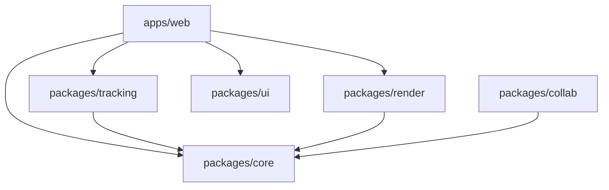
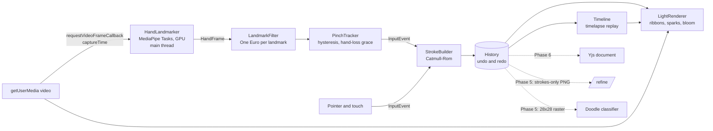

# Architecture

Afterglow turns webcam hand tracking into glowing light strokes in real time, entirely in the browser. This document describes the system as built, and marks the parts that later phases add.

## Packages

| Package             | Responsibility                                                                                                                         | Depends on                 |
| ------------------- | -------------------------------------------------------------------------------------------------------------------------------------- | -------------------------- |
| `packages/core`     | Pure logic: coordinate spaces, One Euro filtering, the pinch state machine, stroke building, undo/redo history, the timelapse timeline | nothing                    |
| `packages/tracking` | Camera access and the MediaPipe Tasks `HandLandmarker` adapter                                                                         | core                       |
| `packages/render`   | Three.js light renderer: ribbons, sparks, bloom, darkroom composite                                                                    | core                       |
| `packages/ui`       | Design tokens, icons, and base React primitives                                                                                        | nothing                    |
| `packages/collab`   | Yjs document schema and binding (Phase 6)                                                                                              | core                       |
| `apps/web`          | The studio: wires the pipeline together and renders the controls                                                                       | core, tracking, render, ui |
| `apps/api`          | Edge API; `/refine` arrives in Phase 5                                                                                                 | nothing                    |
| `apps/realtime`     | Rooms server; the Yjs websocket arrives in Phase 6                                                                                     | nothing                    |
| `ml/`               | Python training pipeline for the doodle classifier (a separate uv project)                                                             | nothing                    |

Internal packages export their TypeScript source and are compiled by the consumer (Vite or Vitest). See [ADR 0001](adr/0001-monorepo-and-pure-core.md).

## Runtime data flow

Solid arrows exist today; dashed arrows are planned.

- **Frames are driven by `requestVideoFrameCallback`**, so each camera frame is processed exactly once. Rendering runs separately on `requestAnimationFrame` and draws the latest state.
- **Everything from `LandmarkFilter` to `History` is in `packages/core`** and never reads a clock: time is passed in with each frame or event.
- **The pipeline runs outside React.** The studio orchestrator (`apps/web/src/studio`) owns the loop and writes cursors and the skeleton overlay straight to the DOM. React renders the controls and reads a zustand store, which the studio updates four times a second with stats.
- **Hand tracking runs on the main thread today.** Phase 1 evaluates a worker behind the same interface and records the decision in an ADR.

## Coordinate spaces

All conversions live in `packages/core/src/coords.ts`, with tests.

1. **Landmark space:** MediaPipe's normalized coordinates of the unmirrored camera image.
2. **View space:** mirrored for display (`x' = 1 - x`), still normalized. Everything the user sees and does is in this space.
3. **Canvas space:** world units of the drawing. The frame is 1000 units tall and keeps the source aspect ratio, so strokes survive window resizes and will sync across screens of different sizes.
4. **Screen space:** CSS pixels. The frame is cover-fit to the viewport.

## Time and latency

Every `HandFrame` carries the camera capture time from `requestVideoFrameCallback` metadata, plus a monotonic `frameId`. Latency is always measured from capture: capture to landmarks, and capture to render submit. Where a browser doesn't expose capture time, the tracker falls back to the callback time, and the stats panel labels the numbers accordingly.

## Depth

MediaPipe's landmark `z` is depth relative to the wrist, not distance from the camera. Apparent palm size (wrist to middle-finger knuckle) is used instead as the "closer is thicker and brighter" signal.

## Rendering layers

1. **Light layer** (offscreen): neon and sparks strokes with additive blending, then `UnrealBloomPass`.
2. **Composite** (screen): the darkroom-treated video (or the night background), plus the bloomed light layer, with highlight compression.
3. **Ink layer:** matte strokes drawn after bloom, so they never glow.
4. **DOM:** pen cursors, the skeleton overlay, and the controls.

Bloom only ever sees light, so bright objects in the room never glow.

## Testing

- **Unit tests (Vitest)** in every package. `packages/core` is deterministic by construction, so filters, gestures, and timelines are tested with synthetic input.
- **End-to-end tests (Playwright)** against the production build. They cover mouse painting and the camera-failure state. Phase 4 adds fixture-driven hand input.
- **Python (`ml/`):** ruff, strict mypy, and pytest.
- **CI** runs all of it on every push and pull request.
