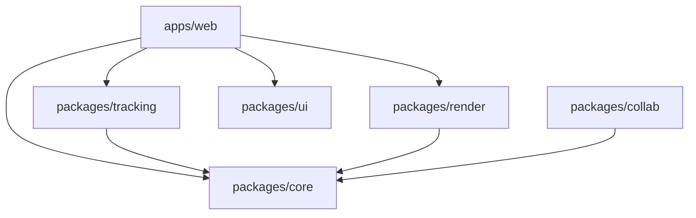
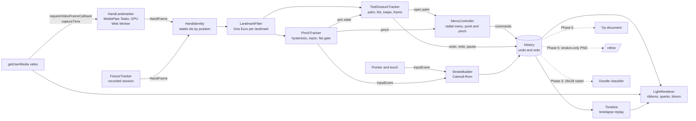

# Architecture

Afterglow turns webcam hand tracking into glowing light strokes in real time, entirely in the browser. This document describes the system as built, and marks the parts that later phases add.

## Packages

| Package             | Responsibility                                                                                                                                                                                  | Depends on                 |
| ------------------- | ----------------------------------------------------------------------------------------------------------------------------------------------------------------------------------------------- | -------------------------- |
| `packages/core`     | Pure logic: coordinate spaces, hand identity, filters, the pinch and tool gesture state machines, stroke building, undo/redo history, the timelapse timeline, drawing files, fixture evaluation | nothing                    |
| `packages/tracking` | Camera access and the MediaPipe Tasks `HandLandmarker` adapter                                                                                                                                  | core                       |
| `packages/render`   | Three.js light renderer: ribbons, sparks, bloom, darkroom composite; stroke outlines and SVG export                                                                                             | core                       |
| `packages/ui`       | Design tokens, icons, and base React primitives                                                                                                                                                 | nothing                    |
| `packages/collab`   | Yjs document schema and binding (Phase 6)                                                                                                                                                       | core                       |
| `apps/web`          | The studio: wires the pipeline together and renders the controls                                                                                                                                | core, tracking, render, ui |
| `apps/api`          | Edge API; `/refine` arrives in Phase 5                                                                                                                                                          | nothing                    |
| `apps/realtime`     | Rooms server; the Yjs websocket arrives in Phase 6                                                                                                                                              | nothing                    |
| `ml/`               | Python training pipeline for the doodle classifier (a separate uv project)                                                                                                                      | nothing                    |

Internal packages export their TypeScript source and are compiled by the consumer (Vite or Vitest). See [ADR 0001](adr/0001-monorepo-and-pure-core.md).

## Runtime data flow

Solid arrows exist today; dashed arrows are planned.

- **Frames are driven by `requestVideoFrameCallback`**, so each camera frame is processed exactly once. Rendering runs separately on `requestAnimationFrame` and draws the latest state.
- **Everything from `HandIdentity` to `History` is in `packages/core`** and never reads a clock: time is passed in with each frame or event. The pen, tool gesture, and menu state machines run from explicit transition tables, drawn in [gesture-fsm.md](gesture-fsm.md) ([ADR 0005](adr/0005-pinch-detection.md), [ADR 0006](adr/0006-tool-gestures.md), [ADR 0009](adr/0009-gesture-menu.md)).
- **The pipeline runs outside React.** The studio orchestrator (`apps/web/src/studio`) owns the loop and writes cursors and the skeleton overlay straight to the DOM. React renders the controls and reads a zustand store, which the studio updates four times a second with stats.
- **Hand tracking runs in a Web Worker**, behind a `HandTracker` interface, with an automatic main-thread fallback ([ADR 0003](adr/0003-hand-tracking-in-a-worker.md)). Camera frames are transferred as `ImageBitmap`s; one is in flight at a time, and the newest frame waits in a one-slot mailbox.
- **The Filter Lab is a second page** (`/lab/`, a second Vite entry). It replays recordings offline through `filterRun` in `packages/core/src/eval`, which uses the same replay and metrics as the benchmarks, and draws plain SVG charts. It loads neither Three.js nor MediaPipe.
- **Recorded sessions replay through the same interface.** `FixtureTracker` plays a recording from `fixtures/sessions` at its original timing (`?fixture=<name>`), so tests and tools get deterministic hand input without a camera. Recordings are made in the studio (press R, or `?record=fixtures` for guided capture) and store landmarks only, never video.

## Coordinate spaces

All conversions live in `packages/core/src/coords.ts`, with tests.

1. **Landmark space:** MediaPipe's normalized coordinates of the unmirrored camera image.
2. **View space:** mirrored for display (`x' = 1 - x`), still normalized. Everything the user sees and does is in this space.
3. **Canvas space:** world units of the drawing. The frame is 1000 units tall and keeps the source aspect ratio, so strokes survive window resizes and will sync across screens of different sizes.
4. **Screen space:** CSS pixels. The frame is cover-fit to the viewport.

## Time and latency

Every `HandFrame` carries the camera capture time from `requestVideoFrameCallback` metadata, plus a monotonic `frameId`. Latency is always measured from capture: capture to landmarks, and capture to render submit. Where a browser doesn't expose capture time, the tracker falls back to the callback time, and the stats panel labels the numbers accordingly.

## Depth

MediaPipe's landmark `z` is depth relative to the wrist, not distance from the camera. Apparent hand size is used instead as the "closer is thicker and brighter" signal, relative to the hand's usual size, so it needs no calibration ([ADR 0011](adr/0011-relative-depth-and-nib.md)).

## Rendering layers

1. **Light layer** (offscreen): neon, sparks, and ribbon strokes with additive blending, then `UnrealBloomPass`.
2. **Composite** (screen): the darkroom-treated video (or the night background), plus the bloomed light layer, with highlight compression.
3. **Ink layer:** matte strokes drawn after bloom, so they never glow.
4. **DOM:** pen cursors, the skeleton overlay, and the controls.

Bloom only ever sees light, so bright objects in the room never glow.

## Saving and opening

- **The PNG** is the renderer's own frame, rendered with fade off and the video hidden: a long exposure, light only.
- **The SVG** (`packages/render/src/svg.ts`) is built from the same stroke outlines as the GPU geometry (`outline.ts`), with blurs and `screen` blending standing in for bloom and additive light.
- **The timelapse video** records the canvas stream while the timeline replays.
- **Drawing files** (`packages/core/src/drawing.ts`) hold the strokes with their timing. Opening one checks every field, fits it to the current frame, and swaps it in as one undoable step ([ADR 0012](adr/0012-exports-and-drawing-files.md)).

## Testing

- **Unit tests (Vitest)** in every package. `packages/core` is deterministic by construction, so filters, gestures, and timelines are tested with synthetic input.
- **End-to-end tests (Playwright)** against the production build:
  - mouse, touch, and keyboard use;
  - erasing;
  - GPU memory;
  - every export, and opening drawing files;
  - recorded hand sessions (strokes, gestures, the gesture menu);
  - the real MediaPipe model on Chrome's fake camera, including the camera stopping and the tracking watchdog;
  - the camera permission messages.
- **Python (`ml/`):** ruff, strict mypy, and pytest.
- **CI** runs all of it on every push and pull request.
