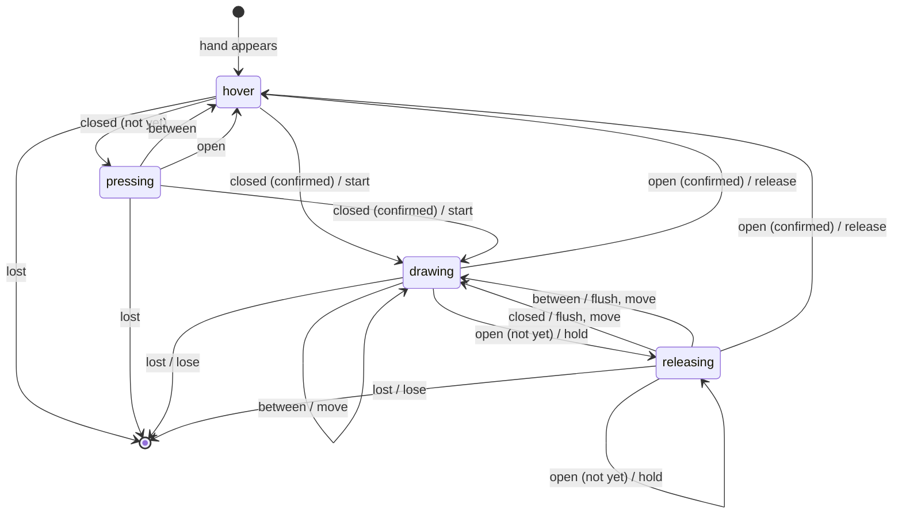

# Pen state machine

Generated from `PEN_TRANSITIONS` in [`packages/core/src/gesture/pinch.ts`](../packages/core/src/gesture/pinch.ts) by `pnpm --filter @afterglow/core docs:fsm`. Don't edit by hand; CI fails if this file is stale.

One state machine runs per tracked hand. Each frame, the pinch measure is classified as **closed** (below `enter`), **open** (above `exit`), or **between** (in the hysteresis band). **lost** means the hand has been missing for longer than the loss grace. The `pressing` and `releasing` states wait for confirmation: `enterFrames` closed frames to start a stroke; `exitFrames` open frames, and at least `exitMs`, to end one.

Hover-only self-loops are omitted from the diagram. The full table:

| From | Input | Confirmation | To | Actions |
| --- | --- | --- | --- | --- |
| hover | closed | confirmed | drawing | start |
| hover | closed | not yet | pressing | hover |
| hover | between |  | hover | hover |
| hover | open |  | hover | hover |
| hover | lost |  | gone | none |
| pressing | closed | confirmed | drawing | start |
| pressing | closed | not yet | pressing | hover |
| pressing | between |  | hover | hover |
| pressing | open |  | hover | hover |
| pressing | lost |  | gone | none |
| drawing | closed |  | drawing | move |
| drawing | between |  | drawing | move |
| drawing | open | confirmed | hover | release, hover |
| drawing | open | not yet | releasing | hold |
| drawing | lost |  | gone | lose |
| releasing | closed |  | drawing | flush, move |
| releasing | between |  | drawing | flush, move |
| releasing | open | confirmed | hover | release, hover |
| releasing | open | not yet | releasing | hold |
| releasing | lost |  | gone | lose |

Actions: **start** and **move** emit stroke events; **hold** keeps a sample back while the fingers may be opening; **flush** emits the held samples when it turns out not to be a release; **release** drops them and ends the stroke; **lose** ends the stroke because the hand is gone.
