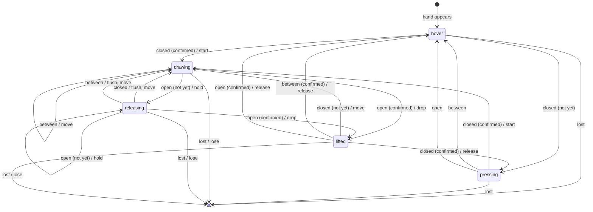
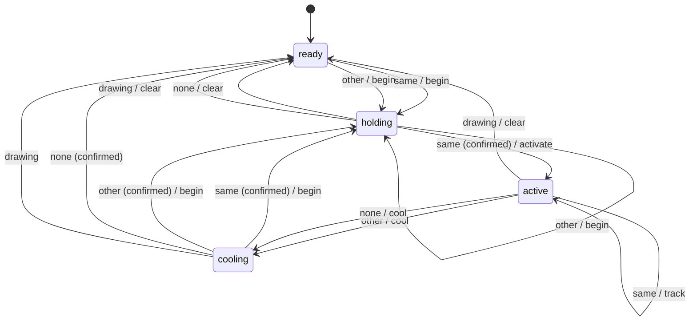

# Gesture state machines

Generated from `PEN_TRANSITIONS` in [`packages/core/src/gesture/pinch.ts`](../packages/core/src/gesture/pinch.ts) and `TOOL_TRANSITIONS` in [`packages/core/src/gesture/tools.ts`](../packages/core/src/gesture/tools.ts) by `pnpm --filter @afterglow/core docs:fsm`. Don't edit by hand; CI fails if this file is stale.

## Pen

One state machine runs per tracked hand. Each frame, the pinch measure is classified as **closed** (below `enter`), **open** (above `exit`), or **between** (in the hysteresis band). **lost** means the hand has been missing for longer than the loss grace. The `pressing` and `releasing` states wait for confirmation: `enterFrames` closed frames to start a stroke; `exitFrames` open frames, and at least `exitMs`, to end one.

Hover-only self-loops are omitted from the diagram. The full table:

| From | Input | Confirmation | To | Actions |
| --- | --- | --- | --- | --- |
| hover | closed | confirmed | drawing | start |
| hover | closed | not yet | pressing | hover |
| hover | between |  | hover | hover |
| hover | open |  | hover | hover |
| hover | lost |  | gone | none |
| pressing | closed | confirmed | drawing | start |
| pressing | closed | not yet | pressing | hover |
| pressing | between |  | hover | hover |
| pressing | open |  | hover | hover |
| pressing | lost |  | gone | none |
| drawing | closed |  | drawing | move |
| drawing | between |  | drawing | move |
| drawing | open | confirmed | lifted | drop |
| drawing | open | not yet | releasing | hold |
| drawing | lost |  | gone | lose |
| releasing | closed |  | drawing | flush, move |
| releasing | between |  | drawing | flush, move |
| releasing | open | confirmed | lifted | drop |
| releasing | open | not yet | releasing | hold |
| releasing | lost |  | gone | lose |
| lifted | closed | not yet | drawing | move |
| lifted | closed | confirmed | pressing | release, hover |
| lifted | between | not yet | lifted | hover |
| lifted | between | confirmed | hover | release, hover |
| lifted | open | not yet | lifted | hover |
| lifted | open | confirmed | hover | release, hover |
| lifted | lost |  | gone | lose |

Actions: **start** and **move** emit stroke events; **hold** keeps a sample back while the fingers may be opening; **flush** emits the held samples when it turns out not to be a release; **release** drops them and ends the stroke; **lose** ends the stroke because the hand is gone.

## Tool gestures

One state machine runs for all hands. Each frame, the hands are reduced to at most one candidate gesture: a held open palm (openMenu), a fist (pause), two fingers up (swipes for undo and redo), or both hands framing (refine). The input is **same** when it's the gesture already being held, on the same hands; **other** for a different one, or an open palm that moved or changed shape, which restarts the hold; **none** when there's no candidate for longer than `gapMs`; and **drawing** while any hand draws. `holding` is confirmed once the gesture's hold time has passed, and `cooling` once `cooldownMs` has.

Waiting self-loops are omitted from the diagram. The full table:

| From | Input | Confirmation | To | Actions |
| --- | --- | --- | --- | --- |
| ready | same |  | holding | begin |
| ready | other |  | holding | begin |
| ready | none |  | ready | none |
| ready | drawing |  | ready | none |
| holding | same | confirmed | active | activate |
| holding | same | not yet | holding | none |
| holding | other |  | holding | begin |
| holding | none |  | ready | clear |
| holding | drawing |  | ready | clear |
| active | same |  | active | track |
| active | other |  | cooling | cool |
| active | none |  | cooling | cool |
| active | drawing |  | ready | clear |
| cooling | same | confirmed | holding | begin |
| cooling | same | not yet | cooling | none |
| cooling | other | confirmed | holding | begin |
| cooling | other | not yet | cooling | none |
| cooling | none | confirmed | ready | none |
| cooling | none | not yet | cooling | none |
| cooling | drawing |  | ready | none |

Actions: **begin** starts holding the frame's candidate; **activate** fires a held gesture (for two fingers up, it arms swipes instead); **track** fires undo or redo for each swipe while two fingers stay up; **cool** starts the cooldown once the pose ends; **clear** drops the candidate.
